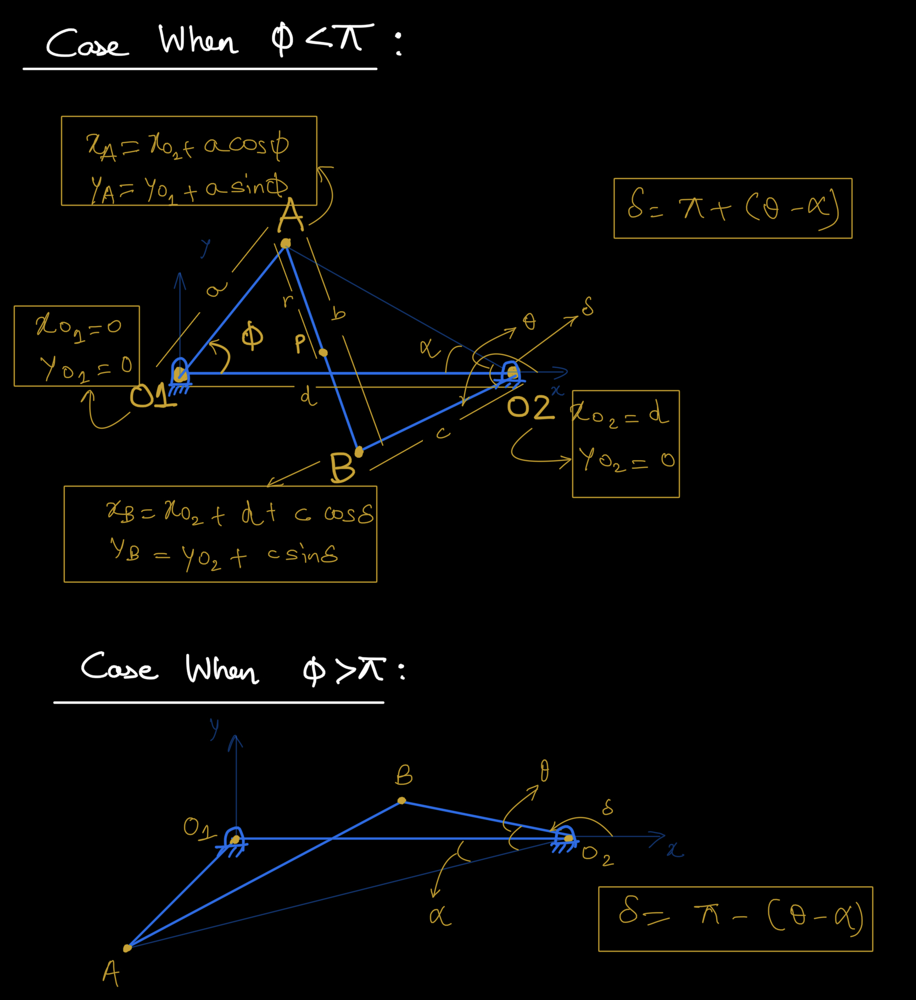
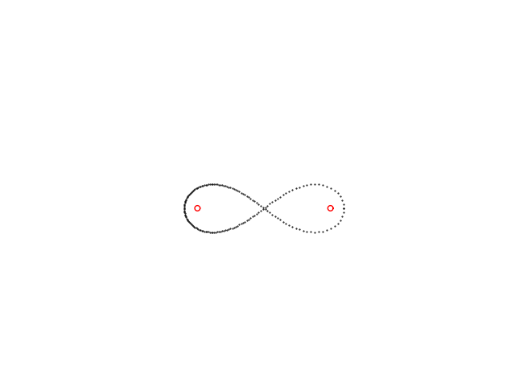

# Wish

I studied Theory of Machines in my undergrad course. Coupler curves are part of this course. My wish is to write computer programs using Python to trace these coupler curves. See [output](#output), four bar mechanism is tracing out infinity curve

# Here's what the code is doing

## Definitions of links and angles

- $O_1$ is the fixed pin on left
- $O_2$ is the fixed pin on right
- line $AO_2$ is a helpful construction that assists in calculation of $\delta$
- $\alpha$ is the angle between $AO_2$ and $O_1O_2$
- $\theta$ is the angle between $AO_2$ and $BO_2$
- $\delta$ is the angle made by the link $BO_2$ with x axis
- Point P is tracing the infinity coupler curve

## Links and distance

| Links                   | Distance |
| ----------------------- | -------- |
| Crank $O_1$A            | a        |
| Coupler AB              | b        |
| Crank B$O_2$            | c        |
| Fixed frame $O_2 O_1$   | d        |
| point P on link AB (AP) | r        |

## Angles and symbol

| Angle              | Symbol           |
| ------------------ | ---------------- |
| $\angle A O_1 O_2$ | phi ($\phi$)     |
| $\angle A O_2 O_1$ | alpha ($\alpha$) |
| $\angle A O_2 B$   | theta ($\theta$) |
| $O_2$B with x-axis | delta ($\delta$) |
| slope of line AB   | gamma ($\gamma$) |

The key is, once the angles are known following relation can be used to find the co-ordinates:
$$ x = cos(angle) $$
$$ y = sin(angle) $$

## Calculation of angles

1. $\phi$ is defined in the code. 2$\pi$ radians are discretized into 180 points. So, $O_1 A$ is the driving crank.
2. $\theta$ is calculated using the cosine formula.
   1. $cos(\theta) = \frac{O_2A^2 + c^2 - b^2}{2.O_2A.c}$
3. $\delta$:
   1. When $\phi$ < $\pi$ => $\delta$ = $\pi + (\theta - \alpha)$
   2. When $\phi$ > $\pi$ => $\delta$ = $\pi - (\theta - \alpha)$
4. $\gamma = tan^{-1} (\frac{y_B - y_A}{x_B - x_A})$

## Calculation of point's co-ordinates

| Point | x co-ordinate                       | y co-ordinate                   |
| ----- | ----------------------------------- | ------------------------------- |
| $O_1$ | $x_{O_1} = 0$                       | $y_{O_1}$ = 0                   |
| $O_2$ | $x_{O_2} = d$                       | $y_{O_2}$ = 0                   |
| A     | $x_A = x_{O_1} + a.cos(\phi)$       | $y_A = y_{O_1} + a.sin(\phi)$   |
| B     | $x_B = x_{O_2} + d + c.cos(\delta)$ | $y_B = x_{O_2} + c.sin(\delta)$ |
| P     | $x_P = x_A + r.cos(\gamma)$         | $y_P = y_P + r.sin(\gamma)$     |

# Output

## animation saved as mp4
[coupler curve: infinity.mp4](infinity_coupler_curve.mp4)

## final traced coupler curve: infinity

### Work products of executing the code

Executing the code 
- will generate a crude animation and 
- write a video titled 'infinity_coupler_curve.mp4' in current directory and
- save an image titled 'infinity_coupler_curve.png' in current directory

### Dependency for executing the code

ffmpeg.exe is required for saving the animation as mp4. ffmpeg executable is downloaded from https://github.com/BtbN/FFmpeg-Builds/releases for win64

