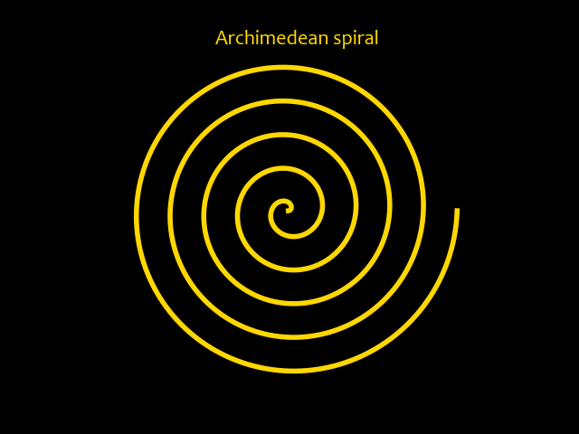
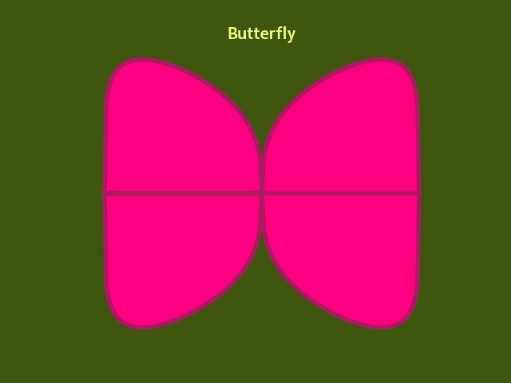
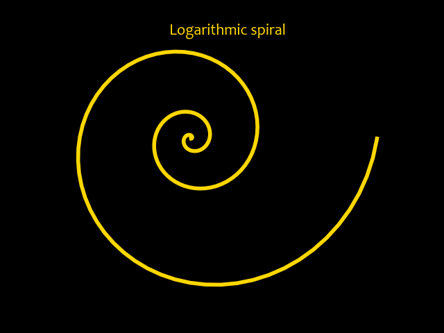

# Famous mathematical curves

This repository contains famous mathematical curves. These curves can be found in architechtural designs, web logos, and even in articles designed for daily use.

## Code design

- A function is defined that returns the x, y coordinates of the curve. Then this function is called.
- Matplotlib library is used to plot these curves. 
  - A figure object is created using `figure` method. `facecolor` argument is used to fill the figure with color.
  - Axis object is created on this figure object using `add_subplot` method. Axis are kept off and title is set using `set_title` method.
  - `plot` method of axis object is used to plot the curve. `fill_between` method is called on this axis object to fill between the curve.
  - `savefig` method of figure object is used to save the image in current working directory.
  - pyplot's `show` method is used to display the image.

## [Archimedian Spiral](archimedean_spiral)

## [Astroid](astroid)

## [Butterfly](butterfly)

## [Dumbbell](dumbbell)

## [Eight curve](eight_curve)

## [Folium](folium)

## [Gear](gear)

## [Lemniscate](lemniscate)

## [Logarithmic spiral](logarithmic_spiral)
