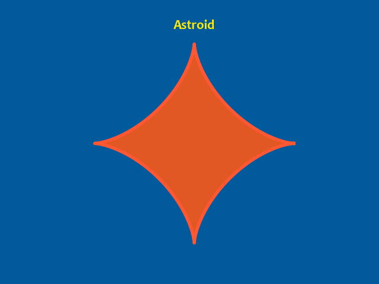

# Astroid
Interesting reads:
- [Astroid (xahlee.info)](http://xahlee.info/SpecialPlaneCurves_dir/Astroid_dir/astroid.html)
- [Astroid (Wikipedia)](https://en.wikipedia.org/wiki/Astroid)

## Equations
- $x = 4 cos^{3}(\phi)$
- $y = 4 sin^{3}(\phi)$

# Output

