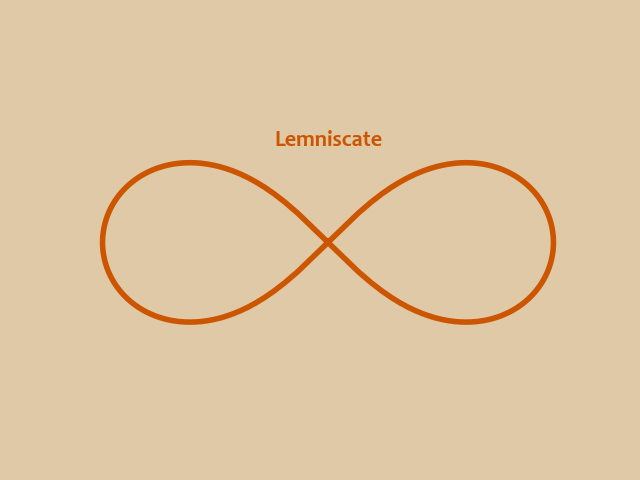

# Infinity curve (Lemniscate of Bernoulli)
Reads:
- [Frozen Figure Eight (University of Georgia)](http://jwilson.coe.uga.edu/EMAT6680Su06/Byrd/Assignment%20Eleven/RBAssignmentEleven.html)
- [Lemniscate of Bernoulli (Math history: University of St Andrews)](https://mathshistory.st-andrews.ac.uk/Curves/Lemniscate/)
- [Lemniscate (Wikipedia)](https://en.wikipedia.org/wiki/Lemniscate)

## Equations
- $r^{2}=2cos(2\phi)$
  - $x = rcos(\phi)$
  - $y = rsin(\phi)$

# Output

