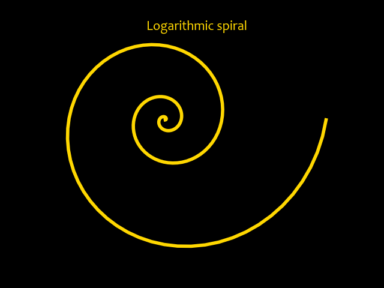

# Logarithmic Spiral
Interesting reads:
- [Logarithmic Spiral (mathcurve.com)](https://mathcurve.com/courbes2d.gb/logarithmic/logarithmic.shtml)
- [Logarithmic Spiral (The Worlds of David Darling)](https://www.daviddarling.info/encyclopedia/L/logarithmic_spiral.html)
- [Logarithmic Spirals (Utah State University)](http://5010.mathed.usu.edu/Fall2022/MGriffeth/Log%20Spiral.html)

## Equations
- $x=e^{k\phi}cos\phi$
- $y=e^{k\phi}sin\phi$

# Output

